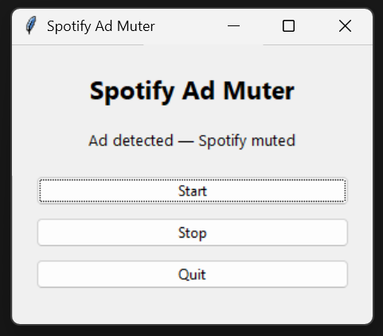

# Spotify Ad Muter

A lightweight Windows utility that automatically mutes Spotify ads and unmutes music afterward.

## Features

- Automatically detects Spotify ads
- Mutes Spotify during ads
- Unmutes when music resumes
- System tray support
- Editable config file
- Lightweight and simple

## Screenshot



---

## Installation

### 1. Install Python

Download Python from:
https://www.python.org/downloads/

### 2. Install dependencies

```bash
pip install -r requirements.txt
```

### 3. Run the app

```bash
python spotify_ad_muter.py
```

---

## Build EXE

```bash
pyinstaller --onefile --windowed --icon=icon.ico spotify_ad_muter.py
```

---

## Config File

The app automatically creates:

```text
AppData/Roaming/SpotifyAdMuter/config.json
```

You can edit the blocked titles list manually.

---

## Disclaimer

This project does not modify Spotify or bypass advertisements.
It only mutes the Spotify audio session locally.

---

## License

MIT